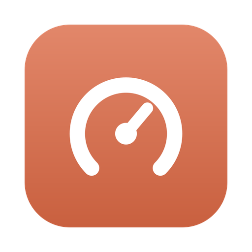
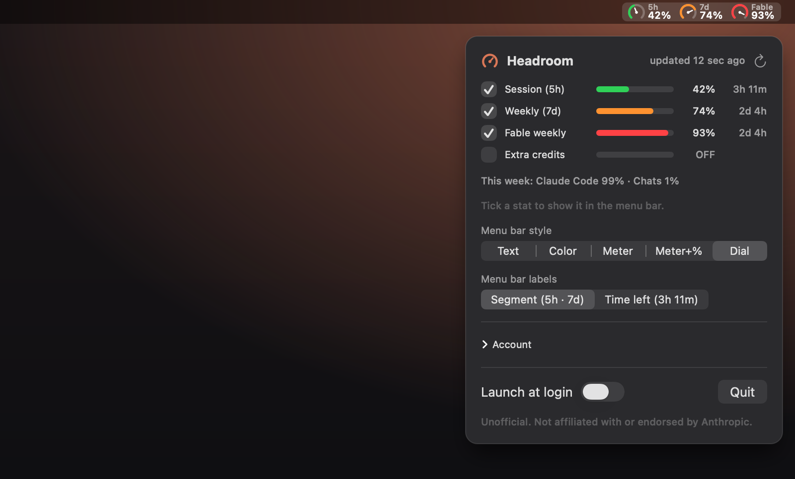

<p align="center"></p>

# Headroom

**Your Claude usage limits, live in the macOS menu bar.** Headroom shows how much of
your Claude plan is left: the 5-hour session, the weekly limit and per-model caps,
with reset countdowns.

**[Download for macOS](https://github.com/CatalystMonish/headroom/releases/latest/download/Headroom.dmg)** ·
[Website](https://catalystmonish.github.io/headroom/)

Free · open source (MIT) · signed & notarized · macOS 14+ · Apple Silicon & Intel



> Unofficial. Not affiliated with or endorsed by Anthropic. Claude and Anthropic are
> trademarks of Anthropic, PBC.

## Features

- **Session, weekly and per-model limits** (e.g. Fable) as colored meters:
  green, then amber at 70%, then red at 90%.
- **Pin any stat to the menu bar** with its checkbox. With nothing pinned, Headroom is
  just a small logo.
- **Menu bar labels:** show each stat by its segment (`5h`, `7d`, `Fable`, the default) or by
  its time left (`3h 11m`).
- **Five styles:** Text, Color, Meter, Meter + %, and speedometer-style Dial.
- **Reset countdowns**, plus this week's split by surface (Claude Code, Chats, …).
- **Private:** no analytics, no servers. The only network requests go to
  `api.anthropic.com`.

## Sign-in

- **Claude Code users:** nothing to do. Headroom reads Claude Code's saved login from
  the macOS Keychain (macOS asks your permission once).
- **Otherwise:** paste an OAuth token under **Account**. It's stored in your Keychain,
  never in a plain file.

The numbers come from the same usage endpoint that claude.ai and Claude Code's `/usage`
use (`GET https://api.anthropic.com/api/oauth/usage`). It's undocumented, so it may
change; Headroom decodes every field as optional and keeps the last good numbers if a
refresh fails.

## Build from source

Requires Xcode 15+ (Swift 5.9) on macOS 14+.

```bash
swift run                     # dev run
./scripts/release.sh          # universal .app, signed + notarized, in dist/Headroom.dmg
NOTARIZE=0 ./scripts/release.sh   # sign only
```

`release.sh` uses your "Developer ID Application" certificate and a notarytool keychain
profile (`NOTARY_PROFILE`; set one up with `xcrun notarytool store-credentials`). With
no certificate it falls back to an ad-hoc signature.

The app icon is generated from `assets/logo.svg`: `npm install && npm run icon`.
The website images are rendered from the real views: `./scripts/screens.sh`.

| File | Role |
|------|------|
| `ClaudeUsage.swift` | Fetches and parses the usage endpoint. |
| `TokenStore.swift` | Claude Code Keychain login, or a pasted token in Headroom's Keychain item. |
| `UsageStore.swift` | Polling (every 60 s), pinned stats, menu bar style. |
| `MenuBarRenderer.swift` | Draws the logo or the pinned stats in the chosen style. |
| `StatusItemController.swift` | The menu bar item and its popover. |
| `PopoverView.swift` | The popup UI. |

## License

MIT. See [LICENSE](LICENSE).
